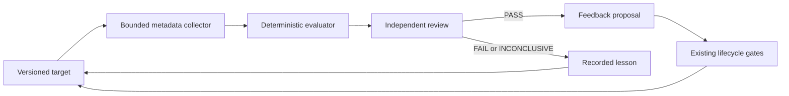

# SKRSI Standard Operating Procedures

SKRSI means **SK Recursive SELF Improvement**, where SELF is **Systematic Evaluation, Learning, and Feedback**. It is the evidence-first improvement loop for SK software lifecycle orchestration.

## 1. Overview

SKRSI owns the contracts for targets, metadata collection, cohort evaluation, bounded experiment proposals, lessons, and feedback handoffs. It does not own authorization, workflow state, merge decisions, deployment, secrets, or protected product data.

## 2. Architecture



Every edge has one producer, one consumer, a bounded queue, timeout, retry policy, recovery owner, and immutable terminal evidence. Existing lifecycle gates remain authoritative.

**Start here:**

- `README.md`: canonical identity, scope, and honest claims.
- `docs/ARCHITECTURE.md`: responsibilities and invariants.
- `SOP.md`: operating and verification procedure.
- `AGENTS.md`: agent execution boundaries.
- `CHANGELOG.md`: dated project history.

## 3. Build

No runtime build is required. This repository publishes portable JSON Schema
contracts and examples. Runtime extraction from SKCapstone requires its own
governed card and release.

## 4. Test

```bash
python3 -m pip install -r requirements-dev.txt
python3 -m unittest discover -s tests -v
git diff --check
```

## 5. Release / Deploy

Release is a reviewed merge to `main`. Deployment is N/A because this repository has no service or network surface. Rollback is a revert of the exact merge commit.

## 6. Configuration / Usage

There is no runtime configuration. Consumers use the canonical name and link here rather than copying the definition.

## 7. API / Reference

The public contract catalog is `docs/CONTRACTS.md`. JSON Schema files live in
`schemas/`, and valid fixtures live in `examples/`. These contracts define
portable records, not a network service. Current runtime APIs live in
SKCapstone under the `skrsi_*` modules. Runtime identifiers remain lowercase
`skrsi`.

## 8. Troubleshooting

| Symptom | Check |
|---|---|
| A document expands SKRSI differently | Replace the expansion with the canonical wording from `README.md`. |
| An experiment claims success with missing gates | Verify the evaluator outcome and independent review evidence. |
| A proposal appears to authorize an action | Stop it and route through the existing lifecycle authorization gate. |
| Historical evidence uses older wording | Preserve it unchanged and add a current explanatory link. |

## 9. Maturity-tier + Version reference

Maturity tier: T0, N/A because this repository handles no key material. Version phase: Incubating v3. Current documentation and contract version: 0.2.0. SKRSI is not a crypto component.

<!-- docs-evidence
verified: 2026-09-09
checks:
  - name: canonical expansion is present
    run: grep -q 'Recursive Systematic Evaluation, Learning, and Feedback Improvement' README.md
  - name: public contracts validate
    run: python3 -m unittest discover -s tests -v
  - name: no runtime package is claimed
    run: test ! -d src
-->
